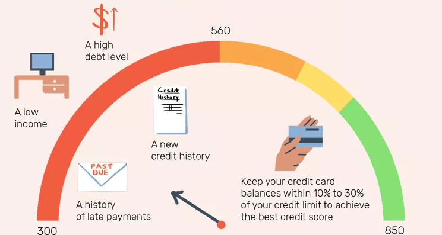

##

**Giriş**

Müşteri kaybı, müşterilerin bir şirketle iş yapmayı bıraktığı durum olarak, bankacılık dahil çeşitli endüstrilerdeki işletmeler için kritik bir endişe kaynağıdır. Müşteri kaybına katkıda bulunan faktörleri anlamak, bankaların müşterileri elde tutma ve karlılığı sürdürme stratejileri geliştirmesine yardımcı olabilir. Müşteri kaybı analizine ek olarak, kredi kartı kullanımı desenlerinin analizi, müşteri davranışı ve tercihleri hakkında değerli içgörüler sağlar.

**Amaç**

Bu proje, bir bankanın veri setinde müşteri kaybı ve kredi kartı kullanımını kapsamlı bir şekilde analiz etmeyi amaçlamaktadır. Veri analitiği tekniklerinden faydalanarak, müşteri kaybını etkileyen ana faktörleri belirlemeyi ve stratejik karar alma süreçlerine yol gösterecek kredi kartı kullanımı desenlerini ortaya çıkarmayı hedefliyoruz.

**Metodoloji**

Analiz, veri ön işleme, keşifsel veri analizi (EDA), özellik mühendisliği ve tahminsel modelleme gibi birkaç adımı içerecektir. Müşteri kaybı ile çeşitli özellikler arasındaki ilişkileri açığa çıkarmak ve gelecekteki kayıp davranışlarını tahmin etmek için istatistiksel teknikler ve makine öğrenimi algoritmaları kullanılacaktır. Ayrıca, harcama alışkanlıkları, tercih edilen kart kategorileri ve demografik eğilimler gibi kredi kartı kullanımı desenlerini keşfedeceğiz.

**Veri**

Bu analiz için veri seti, müşteri demografik bilgilerini, bankacılık metriklerini (örneğin, kredi limiti, toplam işlemler) ve müşteri kaybı durumunu içerir. Hem mevcut hem de ayrılmış müşterileri içerir, bu da kayba katkıda bulunan faktörlerin kapsamlı bir şekilde incelenmesine olanak tanır. Veri seti, anlamlı içgörüler çıkarmak için temizlenecek, dönüştürülecek ve analiz edilecektir.

**Sonuç**

Bu analizin sonuçları, bankanın müşteri elde tutma stratejilerini iyileştirmesi, kredi kartı tekliflerini optimize etmesi ve genel müşteri memnuniyetini artırması için alınabilir içgörüler içerecektir. Müşteri kaybının sürdürülebilirliği azaltmak ve uzun vadeli karlılığı artırmak için müşteri kaybı sürücülerini anlayarak ve kredi kartı kullanımı desenlerinden gelen içgörülerden faydalanarak bilinçli kararlar alabilir.

# Akbank-Veri-Analizi-Bootcamp
